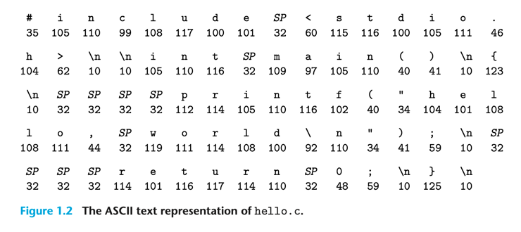
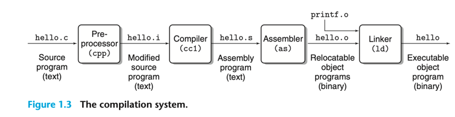
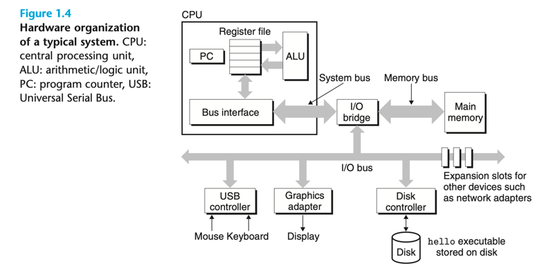

# Computer System A Programmer Perspective

## 1. 컴퓨터 시스템 투어
- 컴퓨터 시스템은 하드웨어와 시스템 소프트웨어들로 동작한다.
- hello.c 프로그램의 생명주기에 대해 이해한다.
  - 프로그래머가 프로그램 작성
  - 시스템에서 실행
  - 메시지 출력
  - 프로그램 종료

### 1.1 정보는 Bits와 Context이다.
- 소스코드 프로그램은 비트의 나열, 바이트라고 불리는 뭉치들의 연속으로 이루어져있다.
  - 각 바이트는 문자열을 표시한다.
  - 대부분의 컴퓨터 시스템은 문자를 표시하기 위해 아스키 코드를 사용한다.
  - 텍스트 파일이라고 불리며 이외의 바일들은 이진파일이라고 불린다.

- 시스템의 모든 정보(파일, 메모리, 네트워크로 전송되는 데이터 등)는 비트 뭉치로 이루어져있다.
  - 데이터를 구분하기 위한 유일한 방법 context(문맥, 맥락)이다.
  - 왜냐하면, 연속된 바이트는 정수, 부동소수점, 문자열, 기계명령 등을 나타낼 수 있기 때문이다. 
- 기계는 정수와 실수를 정확하게 표현하지 않는다.
  - 유한한 근사치를 나타낸다.
  - 따라서 예상치 않는 버그가 발생할 수 있다.

### 1.2 프로그램은 다른 프로그램에 의해 번역된다.
- 소스코드 프로그램 인간이 읽을 수 있는 형태의 코드로부터 시작된다.
  - 하지만 프로그램을 실행하면 다른 프로그램으로부터 컴퓨터가 읽을 수 있는 명령 형태로 변환된다.
    - executable object program으로부터 이진파일로 변형된다.
- 유닉스 시스템에서 컴파일러 드라이버(compiler driver)로 소스파일을 오브젝트 파일로 만드는 것은 다음과 같다.
~~~
gcc -o hello hello.c
~~~

- 다음 4가지 단계를 거친다.
  - Preprocessing phase. The preprocessor (cpp)
    - 전처리기는 c언어에서 '#'으로 시작하는 부분을 변환한다. 
    - e.g. stdio.h안에 있는 내용을 실제로 가져와서 내용을 채우고 
    - 새로운 c언어 파일 hell.i를 생성한다.
  - Compilation phase. The compiler (cc1) 
    - 컴파일러는 텍스트 파일 hello.i를 어셈블리 언어로 변환한다.
    - 모든 high-level언어는 어셈블리 언어로 변환된다.
    - 어셈블리 언어로 변환된 파일은 hello.s 확장자를 가지게 된다.
  - Assembly phase. Next, the assembler (as) 
    - 어셈블러는 최종적으로 기계가 읽을 수 있는 코드로 변환하게 된다.
    - 변환된 파일을 hello.o(object program)으로 변환된다.
      - 이 이진파일은 메인함수 명령을 실행하기 위해 17바이트를 갖게된다.
      - 이 이진 파일을 텍스트 에디터로 열어볼 경우 알수 없는 문장이 나타나게 된다. 
  - Linking phase
    - hello 파일은 c 라이브러리를 호출하게 되고, printf함수는 printf.o라는 별도의 파일에 존재하게 된다.
    - 이때 두 파일을 합쳐주는 것이 linker이고, 이를 합치게 된 결과가 hello(executable object file)이다.
    - hello 파일은 메모리에 적재되어 실행 가능한 상태로 준비된 파일이다.
- gcc는 GNU에서 만든 유용한 도구중 하나이다.
  - gcc는 다음 언어(C, C++, Fortran, Java, Pascal, Objective-C, and Ada)를 번역할 수 있다.
  - GNU는 gcc외 다른 프로그램(emacs editor, gcc compiler, gdb debugger, assembler, linker, utilitie)을 개발했다.

### 1.3 컴파일 시스템이 동작하는 방법을 이해해야하는 이유
- (1) 프로그램 최적화(Optimizing program performance)
  - 컴파일러가 잘 만들어졌기 때문에 컴파일러가 어떻게 동작하는지는 알 필요가 없다.
  - 하지만, 효과적인 코드를 작성하기 위해 안에서 어떻게 동작하는지 알 필요가 있다.(기계어, 어셈블리 번역 등)
  - 예를들어,
    - 어떻게 switch문이 if-else 보다 항상 훨씬 효율적인가?
    - 함수를 호출할 때 얼마나 오버헤드가 발생하는가?
    - while이 for보다 효율적인가?
    - 포인터 참조가 배열보다 효율적인가?
    - 참조로 받은 변수보다 지역변수를 사용할 때 루프가 더 빨라지는 이유는 무엇일까?
- (2) 링크시간의 에러들을 이해하다(Understanding link-time errors)
  - 가장 복잡한 오류 중, 큰 프로그램에서 대부분 링커와 관련된 문제가 발생한다.
  - 예를 들어, 
    - cannot resolve a reference 에러, 
    - static 변수와 global 변수가 무엇이 다른가? 
    - 같은 이름의 지역변수를 두개 정의했을 때 무슨일이 일어나는가?
    - 정적 라이브러리와 동적 라이브러리의 차이가 무엇인가
    - 라이브러리를 나열하는 순서가 왜 중요한가?
    - 그리고 가장 무서운 런타임에 발생하는 링커관련 문제
    - 등을 챕터 7에서 배울 수 있다.
- (3) 보안의 구멍을 회피하다(Avoiding security holes)
  - 버퍼 오버플로우는 수년간 인터넷과 네트워크의 보안 취약점으로 자리잡았다.
    - 그 이유는 많은 프로그래머가 출처를 알 수 없는 데이터로부터 데이터의 양과 형태를 제한하는 것에 대한 이해를 하는 사람들이 적었기 때문이다.
  - 보안 프로그램 작성의 첫번째는 데이터와 제어정보가 프로그램 스택에 어떻게 저장되는가 이해하는 것이다.
  - 챕터 3에서 어셈블리언어를 이용해 버퍼오버플로우를 방지하는 것을 배운다.
  - 프로그래머, 컴파일러, 운영체제에서 보안 방지하는 방법을 배운다.

### 1.4 프로세스는 메모리에 저장된 명령을 읽고(read) 해석(interpret)한다.
~~~
./hello
hello world!
~~~
- 다음 명령을 통해 리눅스는 프로그램을 적재하고 실행한다. 그리고 종료한다.
- hello 프로그램이 동작하는 방법을 알기 위해서는 하드웨어 구성을 알아야한다.

- 버스(buses)
  - 컴퓨터 전체의 바이트 정보를 상호간 옮겨주는 전기 도관
  - 버스는 고정된 크기의 데이터(words, 4바이트(32bit) or 8바이트(64bit))를 옮기도록 설계되었다.
- 입출력 장치(I/O device)
  - 키보드, 마우스, 디스플레이, 디스크가 있다.
  - 각 입출력장치는 어댑터나 컨트롤러에 의해 버스에 연결된다.
- 메인메모리(Main Memory)
  - 메인메모리는 프로그램이 실행되는 동안 임시적으로 데이터가 저장되는 공간이다.
  - 물리적으로, dynamic random access memory (DRAM)으로 구성되어있다.
  - 논리적으로, 0으로 시작하는 선형 배열형태로 되어있다.
- 프로세서(processor)
  - The central processing unit (CPU) 또는 프로세서는 단순히 메인메모리의 명령을 가져오는 엔진이다. 
  - 핵심 기능은 Program Counter(PC)라고 불리는 Word 저장 장치(register)이다.
  - PC는 프로그램이 전원이 종료될 때까지 특정 명령을 수행한다.
  - 프로세서는 PC를 이용하여 메모리로부터 명령을 받아와 명령의 비트를 해석하고 PC를 업데이트한다.
    - 이 과정은 메인메모리, 레지스터 파일, ALU(arithmetic/logic unit)가 처리한다.
  - 레지스터 파일은 각각의 고유의 이름을 가진 word-size 레지스터들로 구성된 작은 저장 장치이다.
  - ALU는 데이터와 주소를 연산한다.
  - CPU가 수행하는 명령어
    - Load: 메인 메모리부터 바이트나 워드를 가져와 레지스터의 내용을 덮어쓴다.
    - Store: 레지스터에서 메인메모리로 바이트나 워드를 덮어쓴다.
    - Operate: 두개의 레지스터에서 데이터를 가져온 후 ALU에서 연산 후 아무 레지스터에 다시 쓴다.
    - Jump: 명령 자체에서 word를 추출하여 PC에 값을 덮어쓴다.
    - 위 수행은 일반적인 수행 명령이고 현대 CPU들은 더 빠른 연산을 위해 더욱 복잡하게 구성되기도 한다.

### 1.4.2 Hello 프로그램의 실행
- ./hello 명령어 실행 시 다음과 같은 동작이 일어난다.
  - I/O 데이터는 버스를 통해 CPU 레지스터로 이통한다.
  - 레지스터에서 명령을 연산한다.
  - 연산된 데이터는 버스를 통해 메모리로 이동 후 메모리에 적재된다.
- hello 오브젝트 파일은 디스크에서 메모리에 적재된다.
- 적재된 데이터는 cpu에서 처리 후 그래픽 처리로 이동한다.