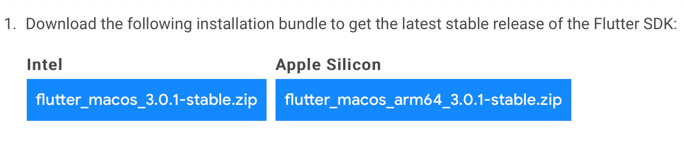
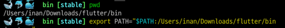
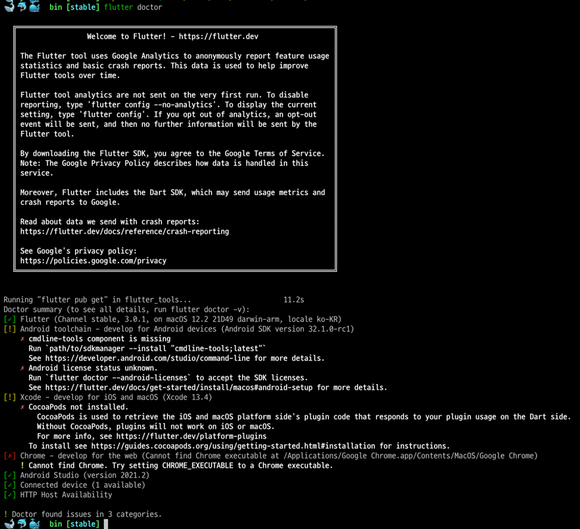
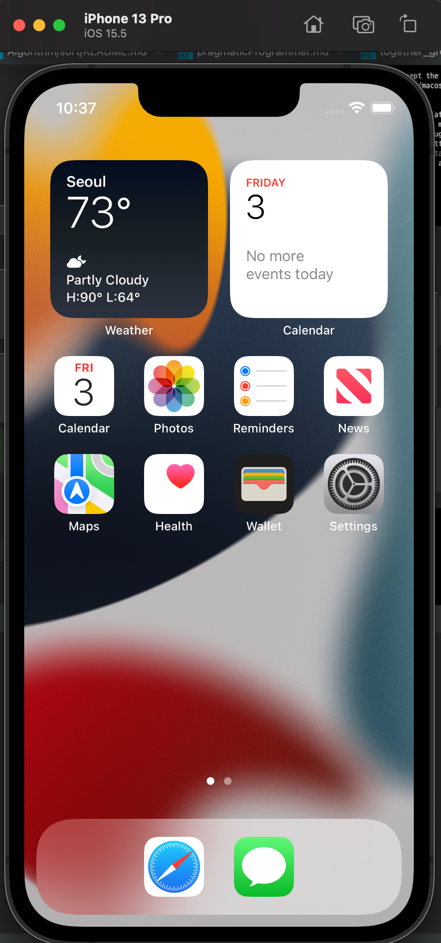
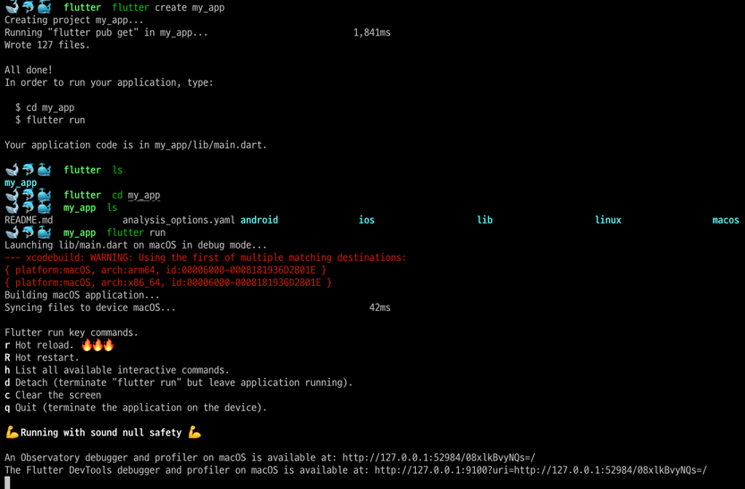
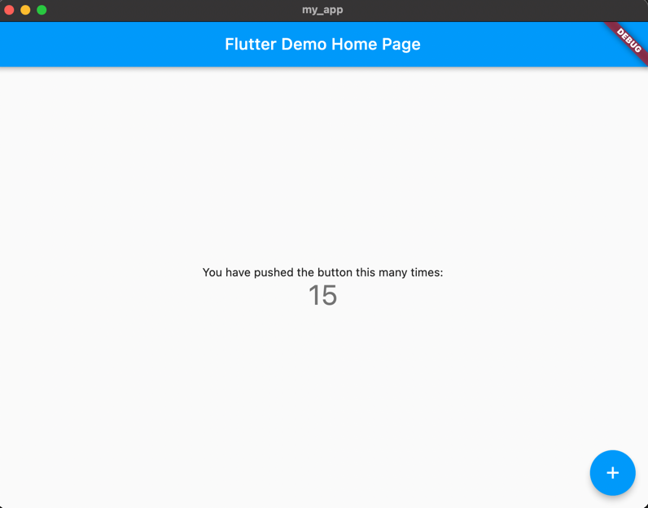
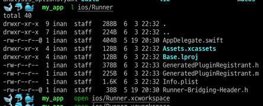
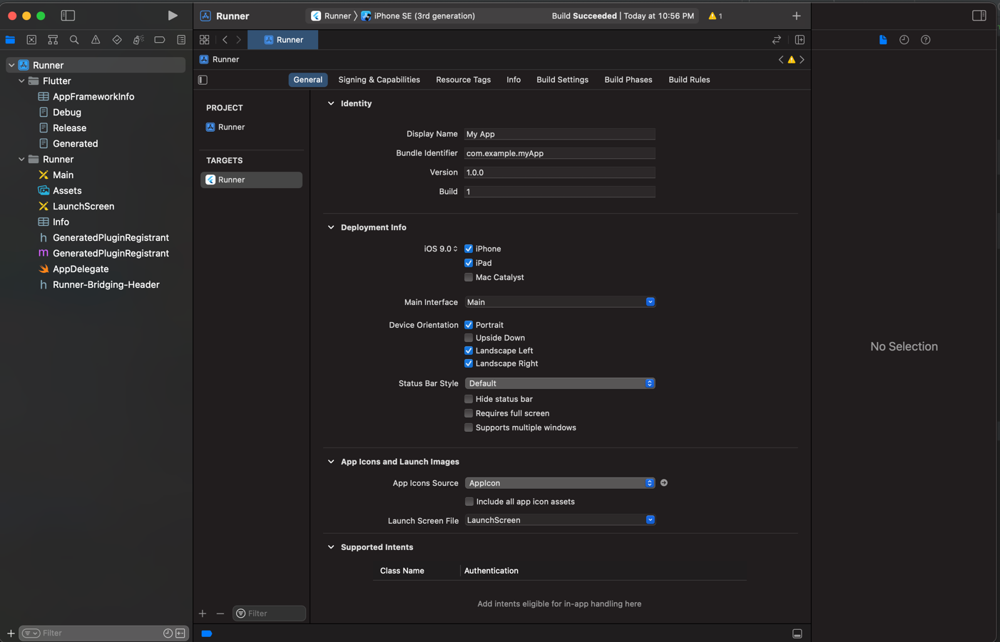
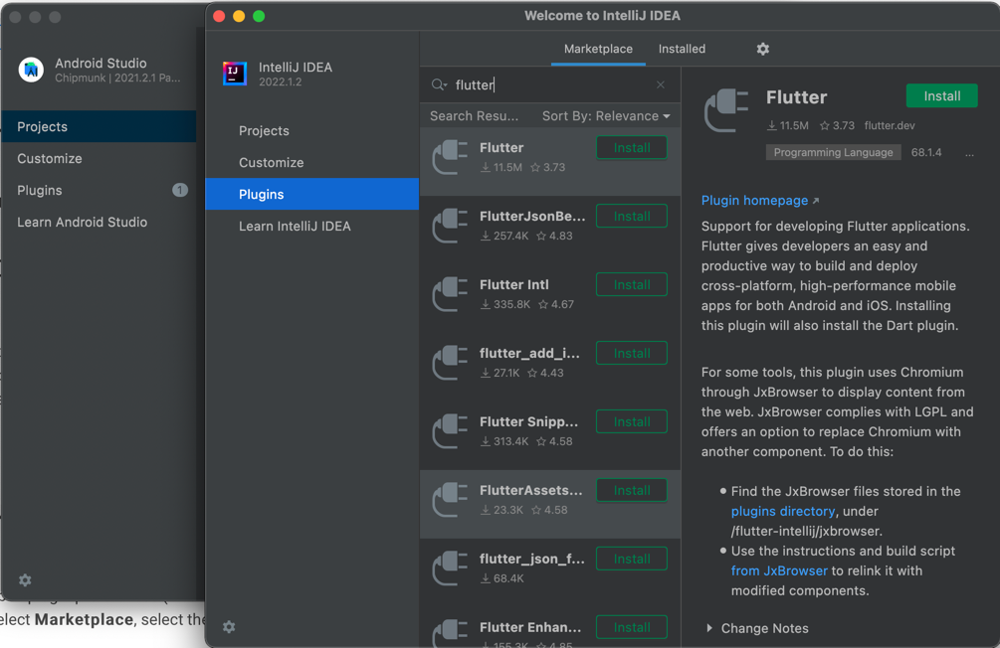

## mac os install
- https://docs.flutter.dev/get-started/install/macos

### 1. Flutter SDK 설치
- 플러터 소프트웨어 도구 설치

- zip 파일 압축 해제
~~~bash
export PATH="$PATH:`pwd`/flutter/bin"
~~~

### 2. flutter doctor 실행
- flutter doctor: 필요한 dependencies와 설치를 완료한다.

### 3. ios 시뮬레이터
- file > open simulator을 통해 다른 기기도 테스트 가능
~~~bash
open -a Simulator
~~~

### 4. 플러터 간단한 앱 생성
~~~bash
flutter create my_app
cd my_app
flutter run
~~~

### 5. ios 장치에 배포(테스트)
- 플러터 앱을 배포하기 위해서는 xcode와 애플 계정이 필요함
- 또한 플러터 플러그인을 사용할 경우 CocoaPods가 필요함.
  - 앱이 플러터 플러그인에 의존하지 않는 경우 이 단계를 건너뛸 수 있음
- CocoaPods 설치
~~~bash
sudo gem install cocoapods
~~~

- 프로젝트 폴더로 이동
~~~bash
open ios/Runner.xcworkspace
~~~

- 화면 상단 중앙에서 디바이스 선택
- 네비게이션 탭에서 runner 선택
- Signing & Capabilities > Team 항목 선택
- 계정 연동(애플 디벨로퍼 아이디)
  - 애플 디벨로퍼 멤버십에 가입해야만 본인 휴대폰에 앱 설치 가능(연 129,000원)
  - 돈이 없다면 시뮬레이터를 제공하니 시뮬레이터로 한다고 생각 하자.

### 안드로이드 배포
- Android 4.1 (API level 16) or higher의 안드로이드 장치가 필요함.

### 안드로이드 에뮬레이터

## IDE 설치
- 플러터는 Android Studio, IntelliJ, VS Code, or Emacs에 플러그인을 설치해서 사용하는 것을 권장한다.
- 플러그인에서 flutter 설치, 종속 패키지 Dart도 설치

