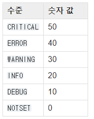

## logging
- 로깅을 사용해야 하는 이유
    - 로깅 레벨을 선택하여 원하는 수준의 로깅만 확인 가능
    - 메시지를 원하는 형태로 쉽게 커스텀 가능(시간추가, 발생위치, 로깅수준, 파일, 함수 등 추가)
    - 손쉽게 파일 저장, 서버 전송 등 제공

- 단순하고 간단한 프로그램에서 일반적으로 출력하기 위한 최고의 도구
    - print()
- 정상 동작 중 발생하는 이벤트 보고
    - logging.info()
    - logging.debug()
    
- 특정 실행 때, 상황을 계속 주시해야하는 경고 메시지를 보낼때
    - logging.warning()
- 예외를 발생시키지 않고 에러를 보고
    - logging.error()
    - logging.exception()
    - logging.critical()

### 1. logging HowTO
- main외 다른 파일에서는 로깅을 정의할 필요 없음
#### 여러 파일에서 로깅
```python
# myapp.py
import logging
import mylib

def main():
    logging.basicConfig(filename='myapp.log', level=logging.INFO)
    logging.info('Started')
    mylib.do_something()
    logging.info('Finished')

if __name__ == '__main__':
    main()

# mylib.py
import logging

def do_something():
    logging.info('Doing something')
```

#### LogRecord attributes
- 사용자 정의 포맷 로깅 생성 가능
    - e.g.
        - 시간 + 로깅수준 + 메시지
        - 로깅수준 + 파일이름 + 함수이름 + 소스코드라인 + 메시지
      

| Attribute name  | Format                                      | Description                                                                                                                                                                                          |
|-----------------|---------------------------------------------|------------------------------------------------------------------------------------------------------------------------------------------------------------------------------------------------------|
| args            | You shouldn’t need to format this yourself. | The tuple of arguments merged into msg to produce message, or a dict whose values are used for the merge (when there is only one argument, and it is a dictionary).                                  |
| asctime         | %(asctime)s                                 | Human-readable time when the LogRecord was created. By default this is of the form ‘2003-07-08 16:49:45,896’ (the numbers after the comma are millisecond portion of the time).                      |
| created         | %(created)f                                 | Time when the LogRecord was created (as returned by time.time()).                                                                                                                                    |
| exc_info        | You shouldn’t need to format this yourself. | Exception tuple (à la sys.exc_info) or, if no exception has occurred, None.                                                                                                                          |
| filename        | %(filename)s                                | Filename portion of pathname.                                                                                                                                                                        |
| funcName        | %(funcName)s                                | Name of function containing the logging call.                                                                                                                                                        |
| levelname       | %(levelname)s                               | Text logging level for the message ('DEBUG', 'INFO', 'WARNING', 'ERROR', 'CRITICAL').                                                                                                                |
| levelno         | %(levelno)s                                 | Numeric logging level for the message (DEBUG, INFO, WARNING, ERROR, CRITICAL).                                                                                                                       |
| lineno          | %(lineno)d                                  | Source line number where the logging call was issued (if available).                                                                                                                                 |
| message         | %(message)s                                 | The logged message, computed as msg % args. This is set when Formatter.format() is invoked.                                                                                                          |
| module          | %(module)s                                  | Module (name portion of filename).                                                                                                                                                                   |
| msecs           | %(msecs)d                                   | Millisecond portion of the time when the LogRecord was created.                                                                                                                                      |
| msg             | You shouldn’t need to format this yourself. | The format string passed in the original logging call. Merged with args to produce message, or an arbitrary object (see Using arbitrary objects as messages).                                        |
| name            | %(name)s                                    | Name of the logger used to log the call.                                                                                                                                                             |
| pathname        | %(pathname)s                                | Full pathname of the source file where the logging call was issued (if available).                                                                                                                   |
| process         | %(process)d                                 | Process ID (if available).                                                                                                                                                                           |
| processName     | %(processName)s                             | Process name (if available).                                                                                                                                                                         |
| relativeCreated | %(relativeCreated)d                         | Time in milliseconds when the LogRecord was created, relative to the time the logging module was loaded.                                                                                             |
| stack_info      | You shouldn’t need to format this yourself. | Stack frame information (where available) from the bottom of the stack in the current thread, up to and including the stack frame of the logging call which resulted in the creation of this record. |
| thread          | %(thread)d                                  | Thread ID (if available).                                                                                                                                                                            |
| threadName      | %(threadName)s                              | Thread name (if available).                                                                                                                                                                          |

#### logging level
- level 설정 시 해당 레벨보다 값이 높은 로깅만 출력할 수 있음
    - e.g. 
      - INFO 설정시 20~50
      - NOTSET 설정시 0~50(all)
      - ERROR 설정시 40~50



### 2. simple logging
- 간단하게 로깅을 사용할 때
```python
import logging

logging.basicConfig(format='%(asctime)s | %(levelname)s: %(message)s', level=logging.NOTSET)

logging.debug('Here you have some information for debugging.')
logging.info('Everything is normal. Relax!')
logging.warning('Something unexpected but not important happend.')
logging.error('Something unexpected and important happened.')
logging.critical('OMG!!! A critical error happend and the code cannot run!')
```

### 3. advanced logging

#### (1) detail control console logging
```python
import logging

# STEP 1
# create a logger object instance
logger = logging.getLogger()

# STEP 2
# specifies the lowest severity for logging
logger.setLevel(logging.ERROR)

# STEP 3
# set a destination for your logs or a "handler"
# here, we choose to print on console (a consoler handler)
console_handler = logging.StreamHandler()

# STEP 4
# set the logging format for your handler
log_format = '%(asctime)s | %(levelname)s: %(message)s'
console_handler.setFormatter(logging.Formatter(log_format))

# finally, we add the handler to the logger
logger.addHandler(console_handler)

# start logging and show messages
logger.debug('Here you have some information for debugging.')
logger.info('Everything is normal. Relax!')
logger.warning('Something unexpected but not important happend.')
logger.error('Something unexpected and important happened.')
logger.critical('OMG!!! A critical error happend and the code cannot run!')
```    

#### (2) detail control console + file logging

```python
import logging

logger = logging.getLogger()
logger.setLevel(logging.NOTSET)

# our first handler is a console handler
console_handler = logging.StreamHandler()
console_handler.setLevel(logging.ERROR)
console_handler_format = '%(asctime)s | %(levelname)s: %(message)s'
console_handler.setFormatter(logging.Formatter(console_handler_format))
logger.addHandler(console_handler)

# the second handler is a file handler
file_handler = logging.FileHandler('sample.log')
file_handler.setLevel(logging.INFO)
file_handler_format = '%(asctime)s | %(levelname)s | %(lineno)d: %(message)s'
file_handler.setFormatter(logging.Formatter(file_handler_format))
logger.addHandler(file_handler)

# start logging and show messages
logger.debug('Here you have some information for debugging.')
logger.info('Everything is normal. Relax!')
logger.warning('Something unexpected but not important happend.')
logger.error('Something unexpected and important happened.')
logger.critical('OMG!!! A critical error happend and the code cannot run!')


# result console
# > 2021-02-15 15:04:25,349 | ERROR: Something unexpected and important happened.
# > 2021-02-15 15:04:25,350 | CRITICAL: OMG!!! A critical error happend and the code cannot run!

# sample.log, you will see more detailed information.
# 2021-02-15 15:04:25,340 | INFO | 22: Everything is normal. Relax!
# 2021-02-15 15:04:25,349 | WARNING | 23: Something unexpected but not important happend.
# 2021-02-15 15:04:25,349 | ERROR | 24: Something unexpected and important happened.
# 2021-02-15 15:04:25,350 | CRITICAL | 25: OMG!!! A critical error happend and the code cannot run!
```