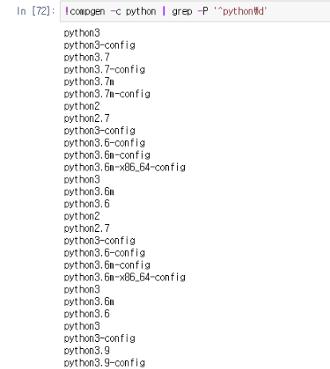

## 1. 파이썬 설치
- 설치시 Add python x.xx to PATH 체크박스 체크 필수
    - install now
        - 기본 인터프리터로 설치
    - Customize installation
        - 보조 인터프리터로 설치
            - 파이참 인터프리터 여러개 등록 후 바꿔가면서 설치 가능
            - 가상환경 생성 시 보조로 쓰임
- 윈도우 버전 확인
```bash
# 설치된 모든 파이썬 확인
py -V # Python 3.9.6
py -VV # Python 3.9.6 (tags/v3.9.6:db3ff76, Jun 28 2021, 15:26:21) [MSC v.1929 64 bit (AMD64)]

py -0p
# -3.9-64        C:\Users\KST2106-09\AppData\Local\Programs\Python\Python39\python.exe *
# -3.8-64        C:\Users\KST2106-09\anaconda3\python.exe
# -3.6-64        C:\Users\KST2106-09\AppData\Local\Programs\Python\Python36\python.exe
```

- 리눅스 버전 확인
```bash
python3 -V
python3 -VV
compgen -c python | grep -P '^python\d'
```

## venv
- 파이썬 3.4부터 venv를 기본으로
    - virtualenv는 라이브러리를 설치해서 사용해야 함.

### 윈도우 터미널 이용 
```bash
# 가상환경 생성
python -m venv venv
py -3.6 -m venv venv

# 가상환경 실행
\venv\Scripts\activate

# 가상환경 종료
deactivate

# 패키지 목록 불러오기
pip freeze > requirements.txt
```


### mac, linux 터미널 이용
```bash
# 가상환경 생성
python3 -m venv venv
python3.6 -m venv venv
python3.9 -m venv venv

# 가상환경 실행
source venv/bin/activate


# 가상환경 종료
deactivate

# requirements.txt 생성
pip freeze > requirements.txt
```


## requirements.txt 파일 생성
```bash
pip freeze > requirements.txt
```
