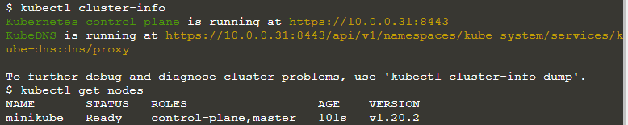
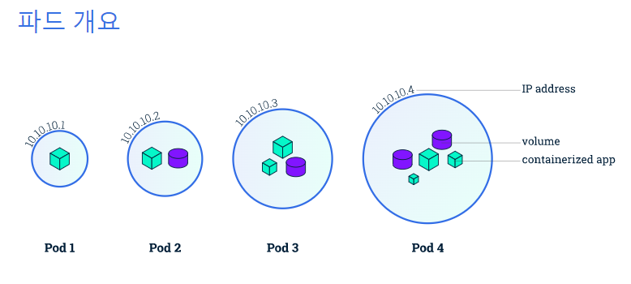
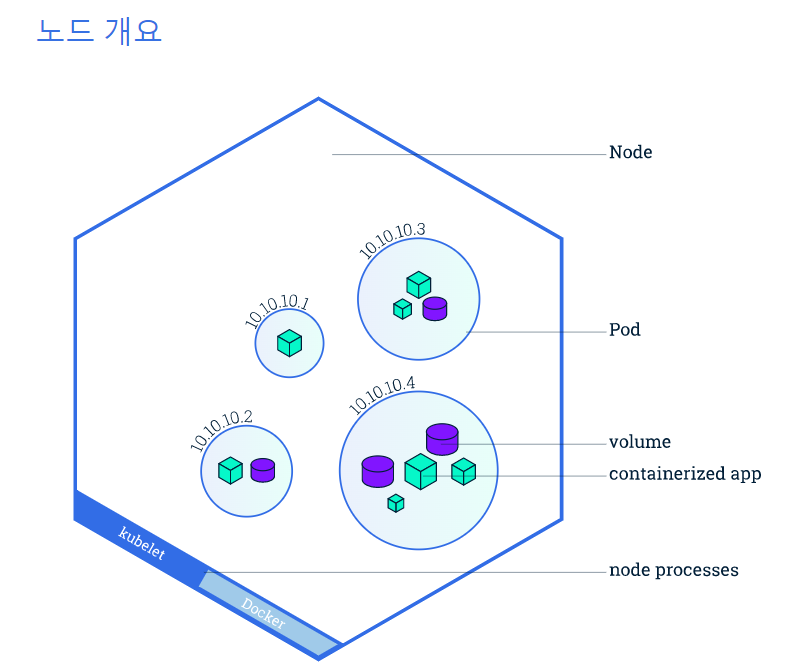

## 쿠버네티스
- 쿠버네티스 사용 이유
    - 애플리케이션이 24/7 가용
    - 하루에도 몇 번이고 새로운 버전의 애플리케이션을 배포
      - 컨테이너화를 통해 소프트웨어를 패키지하면 애플리케이션을 다운타임 없이 릴리스 및 업데이트할 수 있게 됨
    - 쿠버네티스는 이렇게 컨테이너화된 애플리케이션을 원하는 곳 어디에든 또 언제든 구동
    - 애플리케이션이 작동하는데 필요한 자원과 도구를 찾는 것을 도와줌
    
### 쿠버네티스 기초 모듈
1. 쿠버네티스 클러스터 생성(Create a Kubernetes cluster)
2. 애플리케이션 배포(Deploy an app)
3. 앱 조사(Explore your app)
4. 앱 외부로 노출(Expose your app publicly)
5. 애플리케이션 스케일링하기(Scale up your app)
6. 앱 업데이트하기(update your app)

### 클러스터 다이어그램(쿠버네티스 클러스터)
- Control plane: 클러스터 관리를 담당
    - 애플리케이션 스케줄링, 항상성 유지
      - 항상성: 변수를 조절하여 내부환경을 안정적이고 일정하게 유지
    - 새로운 변경사항을 순서대로 반영(rolling out), 클러스터 모든 활동을 조율
    
- Node: 쿠버네티스 클러스터 워커 머신으로 동작하는 VM 또는 물리적인 컴퓨터
    - 각 노드는 노드를 관리
    - Control plane과 통신하는 kubelet이라는 에이전트를 가짐.
    - 컨테이너 운영을 담당하는 containerd 또는 도커와 같은 툴을 가짐
- 쿠버네티스 클러스터는 최소 세개의 노드를 가져야 함.
    - 한 노드가 다운되면 
    
### 1. 클러스터 생성
- minikube 클러스터 생성 및 노드 조회
- Kubectl: 쿠버네티스 관리 CLI
    - 클러스트와 상호작용 하기 위해 쿠버네티스 API를 사용
```markdown
# 설치 및 버전 확인
minikube version 

# 쿠버네티스 클러스터 실행
minikube start

# 클러스터 버전 확인
kubectl version

# 클러스터 상세내용(배포 및 탐색)
kubectl cluster-info

# 모든 노드 조회
kubectl get nodes
```



### 2. 클러스터 배포(Deployment)
- 쿠버네티스 클러스터를 구동시키면, 그 위에 컨테이너화된 애플리케이션을 배포할 수 있다.
    - 쿠버네티스 디플로이먼트 설정 생성 필요
    
- 애플리케이션 인스턴스 생성시 컨트롤러는 지속적으로 인스턴스를 모니터링 함
    - 구동중인 노드 다운 또는 삭제 시 내부의 다른 노드로 교체 -> self-healing

- 앱 배포    
    - 파드는 쿠버네티스 private 공간에서 실행 중이다(고립되어 있음) -> 외부에서 볼 수 없음
        - kubectl을 이용하여 상호작용할 수 있음
```markdown
# 노드에서 애플리케이션을 실행 되도록 예약
# kubectl create deployment 배포이름 이미지-위치
kubectl create deployment kubernetes-bootcamp --image=gcr.io/google-samples/kubernetes-bootcamp:v

# 배포 리스트 확인
kubectl get deployments

```
- kubectl 커맨드로 클러스터와 상호작용할 수 있는 프록시를 생성한다.
    - 쿠버네티스 클러스터와 연결
```markdown
# 새로운 윈도우 창에서 프록시 실행
echo -e "\n\n\n\e[92mStarting Proxy. After starting it will not output a response. e first Terminal Tab\n";

# 프록시 서버로 API를 통해 연결 - 버전 쿼리
curl http://localhost:8001/version

# 파드 이름을 가져와 POD_NAME 변수에 저장
export POD_NAME=$(kubectl get pods -o go-template --template '{{range .items}}{{tadata.name}}{{"\n"}}{{end}}')

# 가져온 파드 이름 환경변수 확인
echo Name of the Pod: $POD_NAME

# API를 통해 파드 확인
curl http://localhost:8001/api/v1/namespaces/default/pods/$POD_NAME/
```

### 3. 앱 탐색(explore)
- 쿠버네티스 파드(pods): 하나 또는 그 이상의 애플리케이션 컨테이너 그룹
    - 컨테이너 자원    
        - 볼륨, 공유 스토리지 
        - 클러스터 IP, 네트워킹
        - 컨테이너 이미지 버전, 포트, 컨테이너 동작 방식 정보
    


- 쿠버네티스 노드(node): 쿠버네티스 워커 머신, 컨트롤 플레인에 의해 관리 됨
    - 여러개의 파드를 가질 수 있음
    - Kubelet 
      - 쿠버네티스 컨트롤 플레인과 노드 간 통신을 책임지는 프로세스
      - 하나의 머신 상에서 동작하는 파드와 컨테이너를 관리
    - 컨테이너 런타임(도커와 같은)은 레지스트리에서 컨테이너 이미지를 가져와 묶여 있는 것을 풀고 애플리케이션을 동작시키는 책임을 맡는다.
    


- kubectl
    - kubectl get: 자원을 나열
    - kubectl describe: 상세정보 조회
    - kubectl logs: 파드 내 컨테이너 로그 출력
    - kubectl exec: 파드 내 컨테이너에 대한 명령을 실행
    
```markdown
# 존재하는 파트 찾아보기
kubectl get pods

# 파드 관련 설명 조회(IP주소, 포트번호, Events: pod의 생명주기)
kubectl describe pods

# Total Requests, 실행 상태 등 로깅 정보를 얻을 수  있음
kubectl logs $POD_NAME

# 파드 환경변수 출력
kubectl exec $POD_NAME -- env

# 파드 bash 접속
kubectl exec -ti $POD_NAME -- bash
```

### 앱 외부로 노출(Expose your app publicly)

```markdown
# 클러스터의 서비스 확인(이름, 타입, ip, port, 실행시간 등)
kubectl get services

#
kubectl expose deployment/kubernetes-bootcamp --type="NodePort" --port 8080 service/kubernetes-bootcamp exposed

# 클러스터 확인 시 추가 된것을 확인할 수 있음
kubectl get services
kubectl describe services/kubernetes-bootcamp

# 노드 포트번호를 가져와 환경변수에 적용(내부 포트 번호) 
export NODE_PORT=$(kubectl get services/kubernetes-bootcamp -o go-template='{{(index .spec.ports 0).nodePort}}')

# 노드 포트 환경포트 확인
echo NODE_PORT=$NODE_PORT

# ip와 포트번호로 접속해보기
curl $(minikube ip):$NODE_PORT
```